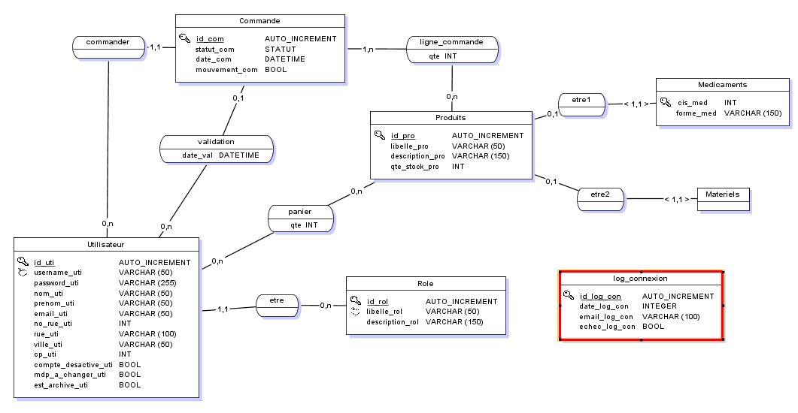

## Contexte

### Description du laboratoire GSB

#### Le secteur d'activité

L’industrie pharmaceutique est un secteur très lucratif dans lequel le mouvement de fusion acquisition est très fort. Les regroupements de laboratoires ces dernières années ont donné naissance à des entités gigantesques au sein desquelles le travail est longtemps resté organisé selon les anciennes structures.

De divers déboires récents autour de médicaments ou molécules ayant entraîné des complications médicales ont fait s'élever des voix contre une partie de l'activité des laboratoires : la visite médicale, réputée être le lieu d' arrangements entre l'industrie et les praticiens, et tout du moins un terrain d'influence opaque.

#### L'entreprise

Le laboratoire Galaxy Swiss Bourdin (GSB) est issu de la fusion entre le géant américain Galaxy (spécialisé dans le secteur des maladies virales dont le SIDA et les hépatites) et le conglomérat européen Swiss Bourdin (travaillant sur des médicaments plus conventionnels), lui même déjà union de trois petits laboratoires . En 2009, les deux géants pharmaceutiques ont uni leurs forces pour créer un leader de ce secteur industriel. L'entité Galaxy Swiss Bourdin Europe a établi son siège administratif à Paris.

Le siège social de la multinationale est situé à Philadelphie, Pennsylvanie, aux EtatsUnis.

La France a été choisie comme témoin pour l'amélioration du suivi de l'activité de visite

### L'application mis en place

L'application présentée dans ce compte rendu permet de gérer la chaine d'approvisionnement des différents laboratoires de l'entreprise GSB.

Elle permet aux différents laboratoires de commander des médicaments ou du matériel.

## Mise en place

### Prérequis

#### XAMPP

XAMPP permet de mettre en place facilement un environnement Apache et un base de données MySQL ou MariaDB.

Pour l'installation il faut se diriger sur [la page de téléchargement de XAMPP](https://www.apachefriends.org/fr/download.html)

Une fois sur la page, téléchargé la version **PHP 8.2.12** :

Une fois téléchargé, lancer l'executable.

Il est possible qu'une fenêtre vous prévienne que votre anti virus est actif. N'y prêtez pas attention et cliquez sur oui :

En suite, faite suivant plusieurs fois :

Vérifié bien que dans le champ ***Select a folder***, le chemin soit `C:\xampp`

Si le programme d'installation vous propose de redémarrer votre poste, redémarrez-le.

### Installation du projet

Une fois XAMPP installé, nous pouvons ajouter le projet en local.

Pour commencer, il faut télécharger le projet depuis [le dépot Github](https://github.com/DavidGailleton/gestionnaire_de_stock_PPE4) :

Une fois téléchargé, extraire le dossier précédemment téléchargé dans le dossier `C:\xampp\htdocs`.

**Attention, l'extracteur vous proposera surement de l'éxtraire dans le dossier `C:\xampp\htdocs\ppe4`. Bien penser à corriger** :

### Base de données MariaDB

Pour mettre la base de données en place, il faut en premier temps démarrer **Apache** et **MySQL** depuis XAMPP :

Il est maintenant possible d'accéder à PHP My Admin pour accéder aux bases de données depuis le navigateur web avec l'addresse [http://localhost/phpmyadmin/](http://localhost/phpmyadmin/)

Pour créer la base de données, il faut en premier temps cliquer sur *Nouvelle base de données* (**1.**), puis donner un nom à la base de données, dans notre cas `ppe4` (**2.**), puis cliquer sur *Créer* (**3.**) :

Nous allons en suite importer la base de données du projet.

Cette base des données est disponible à la racine du projet. L'importation est simplifié par l'interface phpmyadmin :

Si tout s'est déroulé comme prévu, la base de données devrait se présenter comme ceci :

## Base de données

Le MCD si dessus représente 

